# Kalshi Algorithmic Market Maker Bot

[](https://github.com/kel-reid/Kalshi-Trading-Bot/actions/workflows/ci-cd.yml)

[](https://codecov.io/gh/kel-reid/Kalshi-Trading-Bot)

This project is a fully-functional algorithmic market-making trading bot built for the Kalshi prediction market platform. Its primary goal is to provide dual-sided liquidity (bids and asks) on Kalshi markets to capture the bid-ask spread while actively managing inventory risk.

## System Overview

* **Compute:** Managed container execution via Docker and Docker Compose running on a 24/7 DigitalOcean Droplet.
* **Database:** Relational order logs and execution history persisted via a PostgreSQL container.
* **Observability:** Telemetry captured via Grafana Alloy and pushed to a hosted Grafana Cloud instance.
* **Alerting:** Real-time error alerts and critical status updates broadcasted to Discord or Slack via webhooks.

## System Architecture

The following diagram illustrates the relationships between the core trading loop, the PostgreSQL database, DigitalOcean cloud resources, and external observability and alerting components:

```mermaid
graph TD
    subgraph GrafanaCloud ["Grafana Cloud (Managed Monitoring)"]
        Grafana[Grafana Dashboards] -->|Visualize Metrics| CloudProm[Prometheus Database]
    end

    subgraph DigitalOcean ["DigitalOcean Droplet (Cloud VPS)"]
        Alloy[Grafana Alloy Daemon]
        DBVolume[(Host Volume: postgres_data)]

        subgraph DockerContainer ["Docker Container: kalshi-bot"]
            BotLoop[Avellaneda-Stoikov Bot Loop]
            OrderBook[Orderbook Manager]
            InvManager[Inventory Manager]
            OrderManager[Order Manager]
            KillSwitch[Kill Switch]
            Auth[RSA Cryptographic Auth]
        end

        subgraph DBContainer ["Docker Container: kalshi-bot-db"]
            DB[(PostgreSQL Database)]
        end
    end

    subgraph External ["External Services"]
        GHCR[GitHub Container Registry] -->|Deploy Image| DockerContainer
        KalshiWS[Kalshi V2 WebSockets] <-->|Real-time Feed & Fills| OrderBook
        KalshiWS <-->|Fills| InvManager
        OrderManager -->|REST Order Placement/Cancel| KalshiREST[Kalshi V2 REST API]
        KillSwitch -->|Emergency Cancel| KalshiREST
    end

    %% Flow relationships inside the container
    BotLoop -->|Evaluate Risk & Mid Price| OrderBook
    BotLoop -->|Evaluate Exposure| InvManager
    BotLoop -->|Send Quotes| OrderManager
    BotLoop -.->|Interrupt / Safety Shutdown| KillSwitch
    OrderManager -.->|Register Active IDs| KillSwitch
    Auth -.->|Sign Requests| OrderManager
    Auth -.->|Authorize Connection| KalshiWS

    %% Database transaction logging
    OrderManager -->|Write Transaction Logs| DB
    KillSwitch -->|Update Order Status| DB
    DB -->|Persist Data| DBVolume

    %% Telemetry pipeline flows
    Alloy -->|Scrape Metrics: Port 8000| BotLoop
    Alloy -->|Push Metrics: Remote Write| CloudProm

    %% Assign styles to subgraph containers
    style GrafanaCloud fill:#172b22,stroke:#2d5a27,stroke-width:2px;
    style DigitalOcean fill:#0f1d2e,stroke:#1f3c5c,stroke-width:2px;
    style External fill:#1f132e,stroke:#3b205c,stroke-width:2px;
    style DockerContainer fill:#142334,stroke:#264870,stroke-width:1px,stroke-dasharray: 5 5;
    style DBContainer fill:#142334,stroke:#264870,stroke-width:1px,stroke-dasharray: 5 5;
    style DBVolume fill:#2c1913,stroke:#5c3520,stroke-width:1px;
```



## Deployment & Infrastructure

The server infrastructure and security policies are defined using Terraform and hardened using Docker best practices.

### Infrastructure as Code (Terraform)
The `infra` directory contains configuration to spin up the DigitalOcean Droplet, VPC, and firewalls:
*   **VPC Isolation:** The Droplet is placed inside a dedicated private network.
*   **Egress Filtering:** The firewall strictly blocks all outbound ports except `53` (DNS), `443` (HTTPS/WSS to Kalshi and GitHub), and `123` (NTP).
*   **Inbound Protection:** SSH (Port 22) is restricted to your trusted IP ranges. The metrics port (`8000`) is closed to the public internet.

### Docker Hardening & Security
The runtime environment is hardened to ensure a secure production footprint:
*   **Multi-Stage Build:** The Dockerfile compiles all dependencies in a builder container, leaving the final production image clean of compilers like `gcc`.
*   **Non-Root User:** The container runs under a dedicated, low-privilege system user named `trader`.
*   **Healthchecks:** Both PostgreSQL and the trading bot utilize Docker container healthchecks to monitor initialization status and API metrics endpoints automatically.
*   **Local Port Binding:** The Prometheus metrics port is bound strictly to the local loopback interface (`127.0.0.1:8000:8000`), making it inaccessible over the public IP of the Droplet.

### Database Backups
The project includes an automated backup pipeline for the PostgreSQL database containing order execution history. 

Backups are saved to `/root/backups/kalshi-bot/` on the host, and local backups older than 7 days are automatically pruned to prevent disk bloat.

### DigitalOcean Backups
In addition to database-level logical backups, daily full-system snapshots are enabled at the cloud provider level in DigitalOcean for the Droplet. This serves as a disaster recovery safety net to restore the entire operating system, code repository, and configuration files in the event of hardware or virtual machine failure.


## Configuration Parameters

The following parameters customize the bot's trading strategy, risk limits, and database connections. They are loaded dynamically on startup from the `.env` file or the system environment:

| Parameter | Type | Default | Description |
| :--- | :--- | :--- | :--- |
| `KALSHI_ENV` | `string` | `prod` | Kalshi environment connection mode (`demo` or `prod`). Defaults to `prod`; `.env.example` intentionally sets `demo` for safer local onboarding. |
| `TARGET_TICKER` | `string` | - | The market ticker code to quote (e.g., `INX-26AUG-T5700`). |
| `ORDER_SIZE` | `integer` | `1` | Number of contracts to trade per quote side. |
| `MIN_SPREAD` | `integer` | `4` | The minimum profit margin spread (in cents) required to quote. |
| `RISK_GAMMA` | `float` | `0.05` | Inventory risk aversion parameter. Higher values skew prices faster. |
| `DB_HOST` | `string` | `localhost` | Host address of the PostgreSQL database instance. |
| `DB_PORT` | `integer` | `5432` | Port number of the PostgreSQL database. |
| `DB_NAME` | `string` | `kalshi_bot` | Name of the database schema. |
| `DB_USER` | `string` | `postgres` | Username for database authentication. |
| `DB_PASSWORD` | `string` | `postgres` | Password for database authentication. |


## Secrets Management with Doppler

In production, the bot does not store plaintext `.env` configurations or private `.pem` keys on the Droplet host disk. Instead, it utilizes **Doppler** to inject all parameters and keys directly into memory on startup.

### Automated Setup & Deployment
The installation and configuration of Doppler on the Droplet is **fully automated** via the GitHub Actions CI/CD pipeline. 

To enable this integration, the only Doppler-specific requirement is to register your Service Token in your GitHub Repository Secrets (in addition to your standard server deployment secrets like `DROPLET_IP` and `SSH_PRIVATE_KEY`):
* Name: **`DOPPLER_TOKEN`**
* Value: your Doppler production service token (starts with `dp.st.prd.`)

Once the secret is added, pushing to `main` will automatically build the images, verify dependencies, install Doppler on the target server, configure authentication, and launch the bot.


## Live Output Preview

When running, the bot feeds live log output updating its quotes:

```text
[2026-08-02 22:45:12] INFO: Hydrated initial balance: $1,245.50 | Net Position: 0
[2026-08-02 22:45:14] INFO: WebSocket Connected & Hydrated L2 Orderbook.
[2026-08-02 22:45:15] INFO: Midpoint: 54c | Reservation Price: 54c | Spread: 4c
[2026-08-02 22:45:15] INFO: Placing Quotes -> Bid: 52c (x1) | Ask: 56c (x1)
[2026-08-02 22:45:18] INFO: Fill Event Received: Bought 1 YES at 52c. Position: +1 YES
[2026-08-02 22:45:19] INFO: Skewing quotes due to +1 YES position. Res Price: 53.2c
[2026-08-02 22:45:19] INFO: Replacing Quotes -> Bid: 51c (x1) | Ask: 55c (x1)
```

## Financial Disclaimer

This project is for research purposes only. Algorithmic trading carries significant financial risk. Live trading configuration should only be attempted after thorough testing on the Demo environment. Use at your own risk. The authors are not responsible for any financial losses incurred.
