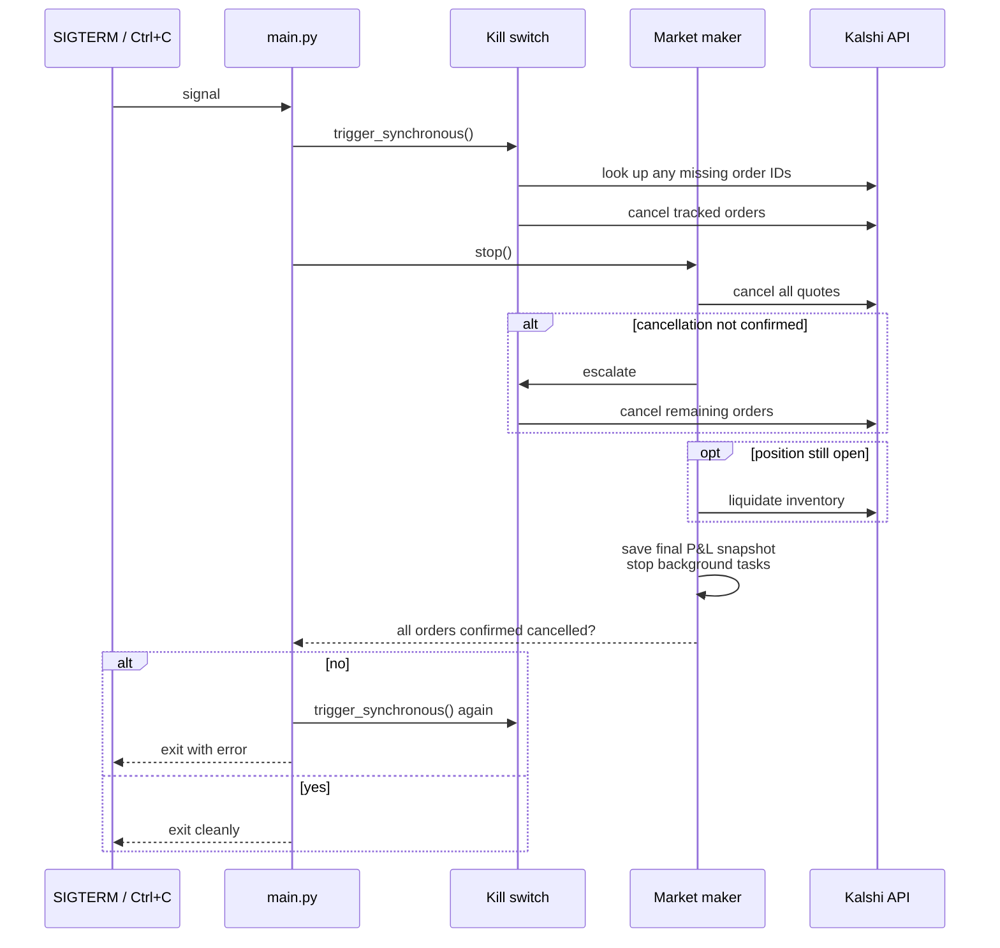

# Kalshi Market Maker

[](https://github.com/kel-reid/Kalshi-Trading-Bot/actions/workflows/ci-cd.yml)
[](https://codecov.io/gh/kel-reid/Kalshi-Trading-Bot)
[](https://www.python.org/)

An asynchronous market maker for [Kalshi](https://kalshi.com) prediction markets. It quotes both sides of in-season sports contracts with Avellaneda-Stoikov pricing, skews its quotes against the inventory it holds, and trades real capital. Because of that, every design choice starts with one question: what happens to open orders and positions when something goes wrong?

## Key Capabilities

- **Avellaneda-Stoikov pricing:** shifts the quote midpoint against current inventory (`r = mid − q·γ`) and places bid and ask `MIN_SPREAD / 2` either side.
- **Inventory hedging:** when the position reaches the hedge threshold (`min(5 × quote size, MAX_HEDGE_INVENTORY)` with dollar sizing), the bot stops adding to it and crosses the spread to reduce it.
- **Safeguards:**
  - **Fast market:** a mid-price move of 6¢ or more within 20 seconds pulls all quotes for 30 seconds.
  - **Price collar:** no quoting when the mid price is below 10¢ or above 90¢.
  - **Session limits:** a $3.00 net loss or $2.50 in fees triggers liquidation and a move to another market.
  - **Post-fill pause:** 3 seconds without quoting after a fill, so the order book can settle.
  - **Pre-settlement exit:** quoting stops and inventory is sold down in slices 90 minutes before expiry.
- **Market discovery:** picks liquid in-season contracts (college football, NFL, NBA, MLB) that expire within 8 days, after checking the live order book.
- **Telemetry:** Prometheus metrics (API latency, inventory, P&L) scraped by Grafana Alloy into Grafana Cloud, with webhook alerts.

For the order these checks run in each second, see **[How It Works](docs/HOW_IT_WORKS.md)**.

## Architecture

- **Runtime:** one asyncio Python service in Docker that handles the WebSocket order-book feed and REST order execution concurrently.
- **State:** PostgreSQL for order history and P&L snapshots; inventory is reconciled against the exchange every 5 minutes.
- **Infrastructure:** a DigitalOcean Droplet provisioned with Terraform, in an isolated VPC with outbound traffic limited to DNS, HTTP/S and NTP.
- **Secrets:** Doppler injects API keys and the RSA signing key at runtime; nothing sensitive is written to disk.
- **Delivery:** GitHub Actions runs tests with coverage, Terraform checks and security scans, then publishes to GHCR and deploys.

The full component diagram is in the **[wiki](https://github.com/kel-reid/Kalshi-Trading-Bot/wiki#system-architecture)**.

## Quick Start

Requires Python 3.12+ (tested on 3.12 and 3.14).

```bash
git clone git@github.com:kel-reid/Kalshi-Trading-Bot.git
cd Kalshi-Trading-Bot
python3 -m venv .venv && source .venv/bin/activate
pip install -r requirements.txt

pytest -v                       # run the test suite
KALSHI_ENV=demo python main.py  # run against Kalshi's demo exchange
```

Set your API credentials first, using `.env.example` as a template. For Docker, Doppler and server setup, see the **[Setup & Operations Guide](docs/SETUP_GUIDE.md)**.

## Key Configuration

| Parameter | Default | What it controls |
| :--- | :--- | :--- |
| `KALSHI_ENV` | `prod` | `demo` or `prod` exchange. Start with `demo`. |
| `TARGET_TICKER` | `""` | A ticker, league (`NFL`) or category. Empty means automatic in-season discovery. |
| `ORDER_DOLLARS` | `1.0` | Dollars allocated per quote; sets the contract size. |
| `MIN_SPREAD` | `4` | Minimum gap between bid and ask, in cents. |
| `RISK_GAMMA` | `0.7` | How strongly quotes skew against inventory. |
| `MAX_SESSION_LOSS_CENTS` | `300` | Session loss that triggers liquidation and rotation. |

Every parameter, including credentials, safeguard thresholds and database settings, is listed in **[Configuration](docs/CONFIGURATION.md)**.

## Shutdown & Risk

On `SIGTERM` or Ctrl+C, the bot won't exit cleanly until the exchange confirms every order is cancelled. For a running bot, the shutdown sequence starts with `trigger_synchronous()`. If a signal arrives during startup, cleanup begins after `KillSwitch` initialization:


```mermaid
sequenceDiagram
  participant OS as SIGTERM / Ctrl+C
  participant Main as main.py
  participant KS as Kill switch
  participant Bot as Market maker
  participant K as Kalshi API

  OS->>Main: signal
  Main->>KS: trigger_synchronous()
  KS->>K: look up any missing order IDs
  KS->>K: cancel tracked orders
  Main->>Bot: stop()
  Bot->>K: cancel all quotes
  alt cancellation not confirmed
    Bot->>KS: escalate
    KS->>K: cancel remaining orders
  end
  opt position still open
    Bot->>K: liquidate inventory
  end
  Bot->>Bot: save final P&L snapshot<br/>stop background tasks
  Bot-->>Main: all orders confirmed cancelled?
  alt no
    Main->>KS: trigger_synchronous() again
    Main-->>OS: exit with error
  else yes
    Main-->>OS: exit cleanly
  end
```

> **Risk notice:** This bot trades real money. Test against the demo exchange (`KALSHI_ENV=demo`) first, and set `ORDER_DOLLARS`, `MAX_SESSION_LOSS_CENTS` and `MAX_HEDGE_INVENTORY` to what you can afford to lose. No warranty is provided; see the [MIT license](LICENSE).

## Sample Output

One quote, fill and requote cycle:

```text
MarketMaker - INFO - [A-S MATH] Mid=25.5c | Size=4 | Inventory=0 | Gamma=0.7 | ReservationPrice=25.50c | Spread=4c → Bid=23c  Ask=28c | Realized=+0.0c | Unrealized=+0.0c
MarketMaker - INFO - >> Placing new BID: 4 YES @ 23c
MarketMaker - INFO - >> Placing new ASK: 4 YES @ 28c
InventoryManager - INFO - Fill processed for KXNCAAFGAME-26OCT10INDNEB-NEB: buy 4 yes @ 23c. New Net Pos: 4.
MarketMaker - INFO - [A-S MATH] Mid=25.5c | Size=4 | Inventory=4 | Gamma=0.7 | ReservationPrice=24.80c | Spread=4c → Bid=22c  Ask=27c | Realized=+0.0c | Unrealized=+10.0c
MarketMaker - INFO - >> Placing new BID: 4 YES @ 22c
MarketMaker - INFO - >> Placing new ASK: 4 YES @ 27c
```

## Documentation

| Document | What's in it |
| :--- | :--- |
| [How It Works](docs/HOW_IT_WORKS.md) | Startup, the per-second quoting loop and each safeguard |
| [Architecture Decisions](docs/ARCHITECTURE_DECISIONS.md) | Why each design choice was made |
| [Configuration](docs/CONFIGURATION.md) | Every parameter and its default |
| [Setup & Operations Guide](docs/SETUP_GUIDE.md) | Provisioning, deploying and operating the bot |
| [Sports Season Router](docs/SPORTS_SEASON_ROUTER.md) | How markets are discovered and ranked |
| [Feature Roadmap](docs/FEATURE_ROADMAP.md) | Planned work with acceptance criteria |

