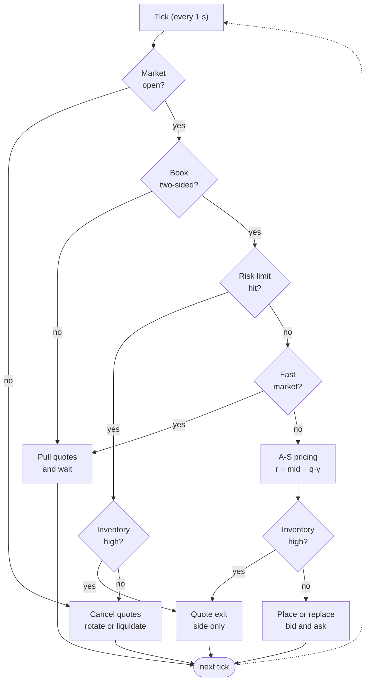

# How It Works

## Startup

1. **Clean up after the last run.** Ask the exchange for every resting order and cancel them, so nothing is left over from a previous crash.
2. **Connect.** Open the Kalshi WebSocket for order-book and fill updates.
3. **Verify the starting position.** Load current inventory from the REST API. If that fails, the bot alerts and refuses to start, because it can't trade safely without knowing its position.
4. **Start the loop.** Subscribe to the market and start a background task that reconciles inventory against the exchange every 5 minutes.

## The Quoting Loop

Every second, the bot runs through these checks in order. Any safety check can stop quoting for that tick.

| Check | What triggers it | What the bot does |
| :--- | :--- | :--- |
| **Market open?** | The market has settled or expired, or is within `EXPIRATION_BUFFER_MINUTES` (90) of expiry | Cancels quotes and sells down inventory in slices, then rotates to the next eligible market. If none is found, it idles. |
| **Book two-sided?** | No best bid or no best ask | Pulls its quotes. If the book stays empty past a timeout, it alerts and rotates. |
| **Risk limit hit?** | Session loss of $3.00, session fees of $2.50, or a mid price outside the 10–90¢ collar | Quotes only the exit side if inventory is high. Otherwise it cancels quotes, then rotates or liquidates. |
| **Fast market?** | A mid-price move of 6¢ or more within 20 seconds, or a fill in the last 3 seconds | Pulls quotes for a cool-down (30 seconds after a fast move, 3 seconds after a fill), so better-informed traders can't pick it off. |
| **A-S pricing** | All checks pass | Shifts the reservation price against inventory, `r = mid − q·γ`, where `q` is inventory divided by quote size when sizing in dollars. Bid and ask sit `MIN_SPREAD / 2` either side. |
| **Inventory high?** | Position at or above `min(5 × quote size, MAX_HEDGE_INVENTORY)` | Stops quoting the side that would add to the position and crosses the spread on the other side to reduce it. |

## Shutdown

On `SIGTERM` or Ctrl+C, the bot won't exit cleanly until the exchange confirms every order is cancelled. The sequence is shown in the [README](../README.md#shutdown--risk).

1. After `KillSwitch` initialization, the signal handler fires the kill switch immediately. If a signal arrives during startup, cleanup begins after initialization through `await killer.trigger()`. For any order without an exchange ID, the kill switch looks it up among the exchange's resting orders. If that lookup fails, it keeps the order on record rather than guessing.
2. `stop()` cancels all quotes. If any cancellation isn't confirmed, it escalates to the kill switch again.
3. Any open position is liquidated.
4. A final P&L snapshot is saved and background tasks are stopped.
5. If orders still can't be confirmed cancelled, the process runs the kill switch once more and exits with an error, so the failure is visible instead of silent.

For the reasoning behind these choices, see [Architecture Decisions](ARCHITECTURE_DECISIONS.md#operational-resiliency-state-reconciliation--graceful-shutdowns).
