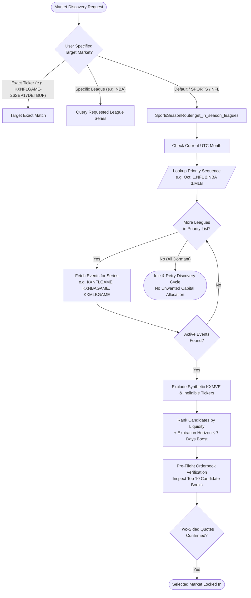

# SportsSeasonRouter Specification & Architecture

## Overview
The `SportsSeasonRouter` is the automated market routing engine responsible for directing the Kalshi trading bot to the highest-liquidity sports markets throughout the calendar year.

Rather than remaining pinned to a single league or suffering orderbook starvation during off-seasons or midweek schedule lulls, the router dynamically cascades through active, in-season sports suites (Game Lines and Player Props) and verifies live two-sided orderbook depth before posting quotes.

## 1. Supported Leagues & Full Product Suites

The router supports the three dominant liquidity drivers on Kalshi: **NFL**, **NBA**, and **MLB**. 

Low-liquidity leagues and off-market sports are permanently excluded from automated routing to prevent the bot from becoming trapped in wide-spread or one-sided orderbooks.

### Full Suite by League

| League | Category | Specific Series Tickers | Description |
| :--- | :--- | :--- | :--- |
| **NFL** | **Game Lines** | `KXNFLGAME` `KXNFLSPREAD` `KXNFLTOTAL` | • Moneyline (Game Winner) • Point Spread • Game Total Over/Under |
| | **Player Props** | `KXNFLANYTD` `KXNFLPASSYDS` `KXNFLRUSHYDS` `KXNFLRECYDS` `KXNFLPASSTD` | • Anytime Touchdown Scorer • Quarterback Passing Yards • Running Back Rushing Yards • Receiver Receiving Yards • Passing Touchdowns Over/Under |
| **NBA** | **Game Lines** | `KXNBAGAME` `KXNBASPREAD` `KXNBATOTAL` | • Moneyline (Game Winner) • Point Spread • Game Total Over/Under |
| | **Player Props** | `KXNBAPTS` `KXNBAREB` `KXNBAAST` `KXNBA3PT` `KXNBAPRA` | • Player Points Over/Under • Player Rebounds Over/Under • Player Assists Over/Under • Player Made 3-Pointers • Points + Rebounds + Assists Combo |
| **MLB** | **Game Lines** | `KXMLBGAME` `KXMLBRUNLINE` `KXMLBTOTAL` | • Moneyline (Game Winner) • Run Line (+/- 1.5 runs) • Total Runs Over/Under |
| | **Player Props** | `KXMLBSTRIKEOUT` `KXMLBHR` `KXMLBHITS` `KXMLBTOTALBASES` | • Pitcher Strikeouts Over/Under • Player to Hit a Home Run • Player Total Hits • Player Total Bases |

## 2. Annual Calendar Priority Matrix

The router inspects the current UTC month to determine active league priorities:

| Month | Active Sports Phase | Priority 1 | Priority 2 | Priority 3 | Behavior if Dormant |
| :--- | :--- | :--- | :--- | :--- | :--- |
| **Jan** | NFL Playoffs / NBA Midseason | **NFL Complete Suite:** • *Lines:* `KXNFLGAME`, `KXNFLSPREAD`, `KXNFLTOTAL` • *Props:* `KXNFLANYTD`, `KXNFLPASSYDS`, `KXNFLRUSHYDS`, `KXNFLRECYDS`, `KXNFLPASSTD` | **NBA Complete Suite:** • *Lines:* `KXNBAGAME`, `KXNBASPREAD`, `KXNBATOTAL` • *Props:* `KXNBAPTS`, `KXNBAREB`, `KXNBAAST`, `KXNBA3PT`, `KXNBAPRA` | — | Idle & Retry Discovery |
| **Feb** | Super Bowl / NBA Post-All-Star | **NFL Super Bowl Suite:** • *Lines:* `KXNFLGAME`, `KXNFLSPREAD`, `KXNFLTOTAL` • *Props:* `KXNFLANYTD`, `KXNFLPASSYDS`, `KXNFLRUSHYDS`, `KXNFLRECYDS`, `KXNFLPASSTD` | **NBA Complete Suite:** • *Lines:* `KXNBAGAME`, `KXNBASPREAD`, `KXNBATOTAL` • *Props:* `KXNBAPTS`, `KXNBAREB`, `KXNBAAST`, `KXNBA3PT`, `KXNBAPRA` | — | Idle & Retry Discovery |
| **Mar** | NBA Stretch Run / MLB Opening | **NBA Complete Suite:** • *Lines:* `KXNBAGAME`, `KXNBASPREAD`, `KXNBATOTAL` • *Props:* `KXNBAPTS`, `KXNBAREB`, `KXNBAAST`, `KXNBA3PT`, `KXNBAPRA` | **MLB Opening Suite:** • *Lines:* `KXMLBGAME`, `KXMLBRUNLINE`, `KXMLBTOTAL` • *Props:* `KXMLBSTRIKEOUT`, `KXMLBHR`, `KXMLBHITS`, `KXMLBTOTALBASES` | — | Idle & Retry Discovery |
| **Apr** | NBA Playoffs / MLB Opening Month | **NBA Playoffs Suite:** • *Lines:* `KXNBAGAME`, `KXNBASPREAD`, `KXNBATOTAL` • *Props:* `KXNBAPTS`, `KXNBAREB`, `KXNBAAST`, `KXNBA3PT`, `KXNBAPRA` | **MLB Complete Suite:** • *Lines:* `KXMLBGAME`, `KXMLBRUNLINE`, `KXMLBTOTAL` • *Props:* `KXMLBSTRIKEOUT`, `KXMLBHR`, `KXMLBHITS`, `KXMLBTOTALBASES` | — | Idle & Retry Discovery |
| **May** | NBA Conf. Finals / MLB Reg Season | **NBA Complete Suite:** • *Lines:* `KXNBAGAME`, `KXNBASPREAD`, `KXNBATOTAL` • *Props:* `KXNBAPTS`, `KXNBAREB`, `KXNBAAST`, `KXNBA3PT`, `KXNBAPRA` | **MLB Complete Suite:** • *Lines:* `KXMLBGAME`, `KXMLBRUNLINE`, `KXMLBTOTAL` • *Props:* `KXMLBSTRIKEOUT`, `KXMLBHR`, `KXMLBHITS`, `KXMLBTOTALBASES` | — | Idle & Retry Discovery |
| **Jun** | NBA Finals / MLB Reg Season | **NBA Finals Suite:** • *Lines:* `KXNBAGAME`, `KXNBASPREAD`, `KXNBATOTAL` • *Props:* `KXNBAPTS`, `KXNBAREB`, `KXNBAAST`, `KXNBA3PT`, `KXNBAPRA` | **MLB Complete Suite:** • *Lines:* `KXMLBGAME`, `KXMLBRUNLINE`, `KXMLBTOTAL` • *Props:* `KXMLBSTRIKEOUT`, `KXMLBHR`, `KXMLBHITS`, `KXMLBTOTALBASES` | — | Idle & Retry Discovery |
| **Jul** | **Summer Lull:** MLB Midseason / All-Star | **MLB Complete Suite:** • *Lines:* `KXMLBGAME`, `KXMLBRUNLINE`, `KXMLBTOTAL` • *Props:* `KXMLBSTRIKEOUT`, `KXMLBHR`, `KXMLBHITS`, `KXMLBTOTALBASES` | — | — | Idle & Retry Discovery |
| **Aug** | MLB Pennant Races *(NFL Preseason Excluded)* | **MLB Complete Suite:** • *Lines:* `KXMLBGAME`, `KXMLBRUNLINE`, `KXMLBTOTAL` • *Props:* `KXMLBSTRIKEOUT`, `KXMLBHR`, `KXMLBHITS`, `KXMLBTOTALBASES` | — | — | Idle & Retry Discovery |
| **Sep** | NFL Kickoff / MLB Final Month | **NFL Complete Suite:** • *Lines:* `KXNFLGAME`, `KXNFLSPREAD`, `KXNFLTOTAL` • *Props:* `KXNFLANYTD`, `KXNFLPASSYDS`, `KXNFLRUSHYDS`, `KXNFLRECYDS`, `KXNFLPASSTD` | **MLB Complete Suite:** • *Lines:* `KXMLBGAME`, `KXMLBRUNLINE`, `KXMLBTOTAL` • *Props:* `KXMLBSTRIKEOUT`, `KXMLBHR`, `KXMLBHITS`, `KXMLBTOTALBASES` | — | Idle & Retry Discovery |
| **Oct** | **Triple Overlap:** NFL, NBA Tip-Off, MLB World Series | **NFL Complete Suite:** • *Lines:* `KXNFLGAME`, `KXNFLSPREAD`, `KXNFLTOTAL` • *Props:* `KXNFLANYTD`, `KXNFLPASSYDS`, `KXNFLRUSHYDS`, `KXNFLRECYDS`, `KXNFLPASSTD` | **NBA Complete Suite:** • *Lines:* `KXNBAGAME`, `KXNBASPREAD`, `KXNBATOTAL` • *Props:* `KXNBAPTS`, `KXNBAREB`, `KXNBAAST`, `KXNBA3PT`, `KXNBAPRA` | **MLB Postseason Suite:** • *Lines:* `KXMLBGAME`, `KXMLBRUNLINE`, `KXMLBTOTAL` • *Props:* `KXMLBSTRIKEOUT`, `KXMLBHR`, `KXMLBHITS`, `KXMLBTOTALBASES` | Idle & Retry Discovery |
| **Nov** | NFL Midseason / NBA Reg Season / MLB Ends | **NFL Complete Suite:** • *Lines:* `KXNFLGAME`, `KXNFLSPREAD`, `KXNFLTOTAL` • *Props:* `KXNFLANYTD`, `KXNFLPASSYDS`, `KXNFLRUSHYDS`, `KXNFLRECYDS`, `KXNFLPASSTD` | **NBA Complete Suite:** • *Lines:* `KXNBAGAME`, `KXNBASPREAD`, `KXNBATOTAL` • *Props:* `KXNBAPTS`, `KXNBAREB`, `KXNBAAST`, `KXNBA3PT`, `KXNBAPRA` | — | Idle & Retry Discovery |
| **Dec** | NFL Playoff Push / NBA Christmas Games | **NFL Complete Suite:** • *Lines:* `KXNFLGAME`, `KXNFLSPREAD`, `KXNFLTOTAL` • *Props:* `KXNFLANYTD`, `KXNFLPASSYDS`, `KXNFLRUSHYDS`, `KXNFLRECYDS`, `KXNFLPASSTD` | **NBA Complete Suite:** • *Lines:* `KXNBAGAME`, `KXNBASPREAD`, `KXNBATOTAL` • *Props:* `KXNBAPTS`, `KXNBAREB`, `KXNBAAST`, `KXNBA3PT`, `KXNBAPRA` | — | Idle & Retry Discovery |

## 3. Routing & Selection Architecture

## 4. Liquidity Scoring & Horizon Multipliers

To prevent selecting multi-year distant futures with misleading historical volume (such as 2-year season props), contracts are scored with dynamic expiration multipliers:

$$\text{Score} = \left( (\text{HasQuotes} \times 1,000,000) + \text{SeriesBonus} + \text{Vol} + (\text{OI} \times 0.5) \right) \times \text{HorizonMultiplier}$$

### Expiration Horizon Weights
* **$\le 7$ Days (Upcoming this week):** **$3.0\times$**
* **$\le 14$ Days (Next week):** **$2.0\times$**
* **$\le 30$ Days (This month):** **$1.5\times$**
* **$\le 90$ Days (This season):** **$1.0\times$**
* **$\le 365$ Days (Longer term):** **$0.5\times$**
* **$> 365$ Days (Distant futures):** **$0.05\times$** (heavily discounted)

### In-Season Series Bonus
Contracts matching active league prefixes (`KXNFL`, `KXNBA`, `KXMLB`) receive a flat **+500,000** boost in the liquidity scoring formula.

## 5. Pre-Flight Live Orderbook Check
Before committing the market maker to any contract, the bot performs a lightweight REST query to `/trade-api/v2/markets/{ticker}/orderbook` on the top 10 ranked candidates:
* **Validation Criteria:** Both `len(yes_bids) > 0` and `len(no_bids) > 0`.
* **Failover:** If a candidate is dormant or has one-sided quotes, it is bypassed in favor of the next candidate. If all top 10 are unquoted, the router falls back to the next league in the seasonal cascade.
