# Kalshi Algorithmic Market Maker Bot Documentation

Welcome to the **Kalshi Algorithmic Market Maker Bot** Knowledge Base.

This system provides continuous dual-sided liquidity (bids and asks) on the Kalshi prediction exchange using a high-performance, asynchronous Avellaneda-Stoikov pricing engine with active inventory skewing, automated seasonal sports discovery, and hardened cloud infrastructure.

---

## Documentation Directory

| Guide | Description |
| :--- | :--- |
| **[[Architecture-Decisions\|Architecture Decisions]]** | In-depth Architectural Decision Records (ADRs) covering pricing math, storage, secrets, and concurrency. |
| **[[Sports-Season-Router\|Sports Season Router]]** | Annual sports priority matrix (NFL, NBA, MLB), weekly contract horizon constraints, and preflight quote verification. |
| **[[Feature-Roadmap\|Feature Roadmap]]** | Prioritized 5-phase engineering roadmap following the **Measure $\to$ Protect $\to$ Optimize $\to$ Scale** lifecycle. |
| **[[Setup-Guide\|Setup & Operations Guide]]** | Complete server provisioning, Doppler secrets, droplet runtime commands, and Grafana Cloud observability. |

---

## System Architecture

```mermaid
graph TD
    subgraph GrafanaCloud ["Grafana Cloud (Managed Monitoring)"]
        Grafana[Grafana Dashboards] -->|Visualize Metrics| CloudProm[Prometheus Database]
    end

    subgraph DigitalOcean ["DigitalOcean Droplet (Cloud VPS)"]
        Alloy[Grafana Alloy Daemon]
        DBVolume[(Host Volume: postgres_data)]

        subgraph DockerContainer ["Docker Container: kalshi-bot"]
            BotLoop[Avellaneda-Stoikov Bot Loop]
            OrderBook[Orderbook Manager]
            InvManager[Inventory Manager]
            OrderManager[Order Manager]
            KillSwitch[Kill Switch]
            Auth[RSA Cryptographic Auth]
        end

        subgraph DBContainer ["Docker Container: kalshi-bot-db"]
            DB[(PostgreSQL Database)]
        end
    end

    subgraph External ["External Services"]
        GHCR[GitHub Container Registry] -->|Deploy Image| DockerContainer
        KalshiWS[Kalshi V2 WebSockets] <-->|Real-time Feed & Fills| OrderBook
        KalshiWS <-->|Fills| InvManager
        OrderManager -->|REST Order Placement/Cancel| KalshiREST[Kalshi V2 REST API]
        KillSwitch -->|Emergency Cancel| KalshiREST
    end

    %% Flow relationships inside the container
    BotLoop -->|Evaluate Risk & Mid Price| OrderBook
    BotLoop -->|Evaluate Exposure| InvManager
    BotLoop -->|Send Quotes| OrderManager
    BotLoop -.->|Interrupt / Safety Shutdown| KillSwitch
    OrderManager -.->|Register Active IDs| KillSwitch
    Auth -.->|Sign Requests| OrderManager
    Auth -.->|Authorize Connection| KalshiWS

    %% Database transaction logging
    OrderManager -->|Write Transaction Logs| DB
    KillSwitch -->|Update Order Status| DB
    DB -->|Persist Data| DBVolume

    %% Telemetry pipeline flows
    Alloy -->|Scrape Metrics: Port 8000| BotLoop
    Alloy -->|Push Metrics: Remote Write| CloudProm

    %% Assign styles to subgraph containers
    style GrafanaCloud fill:#172b22,stroke:#2d5a27,stroke-width:2px;
    style DigitalOcean fill:#0f1d2e,stroke:#1f3c5c,stroke-width:2px;
    style External fill:#1f132e,stroke:#3b205c,stroke-width:2px;
    style DockerContainer fill:#142334,stroke:#264870,stroke-width:1px,stroke-dasharray: 5 5;
    style DBContainer fill:#142334,stroke:#264870,stroke-width:1px,stroke-dasharray: 5 5;
    style DBVolume fill:#2c1913,stroke:#5c3520,stroke-width:1px;
```

---

## Core Components

1. **Market Discovery & Dynamic Rotation**:
   - Automated selection of in-season sports contracts (NFL, NBA, MLB) through `SportsSeasonRouter`.
   - Pre-flight orderbook probing ensures the bot only quotes active contracts with existing two-sided liquidity.
   - Enforces a strict weekly horizon (`MAX_EXPIRATION_DAYS = 8`) to maintain capital velocity and prevent multi-month capital lockup.

2. **Avellaneda-Stoikov Pricing Engine**:
   - Calculates reservation price skewed against current inventory:
     $$R = \text{MidPrice} - (q \times \gamma)$$
   - Places quotes symmetrically around reservation price:
     $$\text{Bid} = R - \frac{\text{Spread}}{2}, \quad \text{Ask} = R + \frac{\text{Spread}}{2}$$
   - Enforces active inventory hedging thresholds ($\pm 5$ contracts) to aggressively cross the spread and de-risk.

3. **Infrastructure & Observability**:
   - Hardened DigitalOcean Droplet managed via Terraform and Docker Compose.
   - Secrets managed via Doppler in memory without storing plaintext `.env` or `.pem` keys on disk.
   - Telemetry collected via local Grafana Alloy daemon and streamed to hosted Grafana Cloud.
